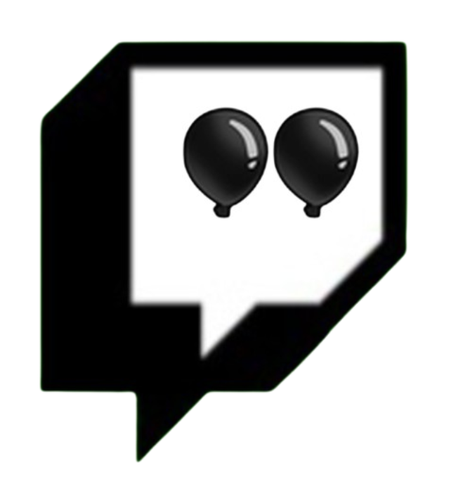

<h1 align="center">

All Luck
</h1>

### Allows twitch streamers to connect their stream's chat to the game and lets them run commands that affects the actual game.

* No OAuth required
* Multiple commands (!sell, !halfcash, etc.)
* Toggle commands on/off

